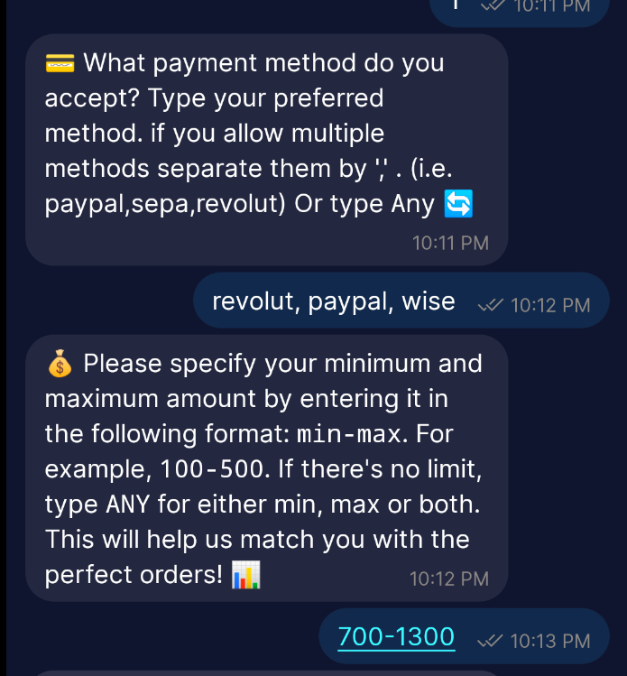
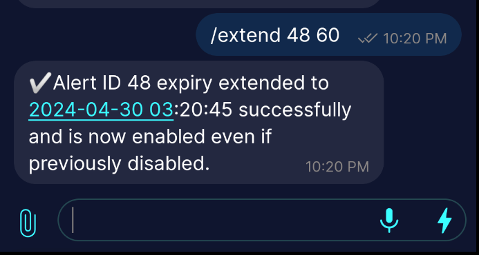

# Robosats Alert Bot for SimpleX

## Index
- [Overview](#overview)
- [User Guide](#user-guide)
- [Project Structure](#project-structure)
- [Self Hosting](#self-hosting)

## Overview

This project features a SimpleX bot designed to notify you when an order that meets your requirements (in terms of currency, premium, payment method and amount) is posted on RoboSats.
It was created to align with RoboSats' privacy philosophy by leveraging Simplex's security and privacy.

## User Guide

Follow these steps to interact with the Simplex Chat Bot:

### 1. Connect to the Chat Bot

Connect to the chat bot using this link: [Simplex Chat Bot](https://simplex.chat/contact/#/?v=1-4&smp=smp%3A%2F%2FPQUV2eL0t7OStZOoAsPEV2QYWt4-xilbakvGUGOItUo%3D%40smp6.simplex.im%2F1hxVU2uzv58rmvUTWbzwqYzNwK1xHTjQ%23%2F%3Fv%3D1-2%26dh%3DMCowBQYDK2VuAyEAdmTemke6RDWl1PS3RoHMkJ7U773pXb1o1HnlQ24wT3k%253D%26srv%3Dbylepyau3ty4czmn77q4fglvperknl4bi2eb2fdy2bh4jxtf32kf73yd.onion).


### 2. Getting started
#### Welcome

Upon connection, you will be greated by the bot with the message below:


#### /help command

Firstly, it is recommended to send the command `/help` to have an overview on how to interact with the bot.


#### Alert Creation

This is easy, just type /new, and the bot will guide through the creation of the alert step buy step:


You will be asked on what kind of order you are interested in, simply type what the bot ask you at each step:


When the alert is created, the bot will send you a confirmation with the content of the alert just created:




#### Match Found notification

The bot will keep checking in the background for new orders matching your requirement.
Anytime a new match is found, the bot will inform you as follows:


Detailed information about the order will be given (order ID, Premium, Payment Method accepted and amound).
It will also send you the onion link to place the order, and the coordinator name hosting that order.

#### Alert Management

type /list to have an overview on all your alerts, enabled and disabled.


You can manage them by changing their status (from disable to enabled) and viceversa, or you can remove them from the database:


Buy default every alert will be created with a lifetime of 7 days.
After 7 days they will be automatically disabled. At any time you can extend the lifetime of an alert by typing /extend (alert id) (number of days).
In the example below we extend the lifetime of the alert 48, by 60 days from current date:




...

## Project Structure

Here's a brief overview of the key components in this project:

### JavaScript Files

- **`bot.js`**: The core of the chat bot, handling user interactions, processing commands, and managing user sessions. It establishes the WebSocket connection to the Simplex Chat server, listens for incoming messages from the users to respond according to `alert.db` alerts and notifications status.

### Python Scripts

- **`matcher.py`**: This script processes user-defined alert criteria against the Robosats federation orderbooks to find matches. When a match is found, it triggers notifications to be sent to the user through the chat bot.

- **`orderbook_downloader.py`**: Responsible for downloading the latest orderbooks data from Robosats coordinators. It saves this data locally to be processed by `matcher.py` for matching against user alerts.

### Data Files

- **`data/alert.db`**: A SQLite database file that stores user alerts, matches, and notification statuses. It is interacted with by both bot.js and the matcher.py script.

- **`data/currency.json`**: Contains mapping of currency codes to currency names, used by the matcher script to validate and process user alerts based on currency preferences.

- **`data/federation.json`**: Holds information about the different coordinators.

- **`data/orderbook/`**: A directory containing JSON files with order book data downloaded by `orderbook_downloader.py`.

## Self Hosting

You could also self host the bot:

### Prerequisites

To self-host it, firstly you need to install [SimpleX Chat terminal CLI](https://github.com/simplex-chat/simplex-chat/blob/stable/docs/CLI.md), and have it run in the background at port 5225 like this:
   ```bash
   simplex-chat -p 5225
   ```

You also need tor socks5, listnening at 127.0.0.1:9050. 

### Installation

First, you need to clone the `simplex-chat` repository. This is necessary to use the dependencies needed by the bot:

```bash
git clone https://github.com/simplex-chat/simplex-chat.git
```

Move to the TypeScript library folder of simplex-chat and install the dependencies needed:
```bash
cd simplex-chat/packages/simplex-chat-client/typescript
npm i simplex-chat
npm run build
```

Next, clone this project to your local machine:
```bash
git clone https://github.com/lft3t8bx/Robosats-Orderbook-Alert-Bot-for-SimpleX-Chat.git
```

Install the dependencies needed for bot.js and the Python scripts:
```bash
npm install sqlite3
npm install bottleneck
npm install node-schedule

pip install requests
pip install PySocks
```

Finally, to run the bot and the necessary scripts, navigate to the project directory and start them:

```bash
cd Robosats-Orderbook-Alert-Bot-for-SimpleX-Chat
node bot.js
python3 matcher.py
python3 orderbook_downloader.py
```

For the bot to function properly, the SimpleX Chat terminal CLI, bot.js, matcher.py, and orderbook_downloader.py must run simultaneously.
